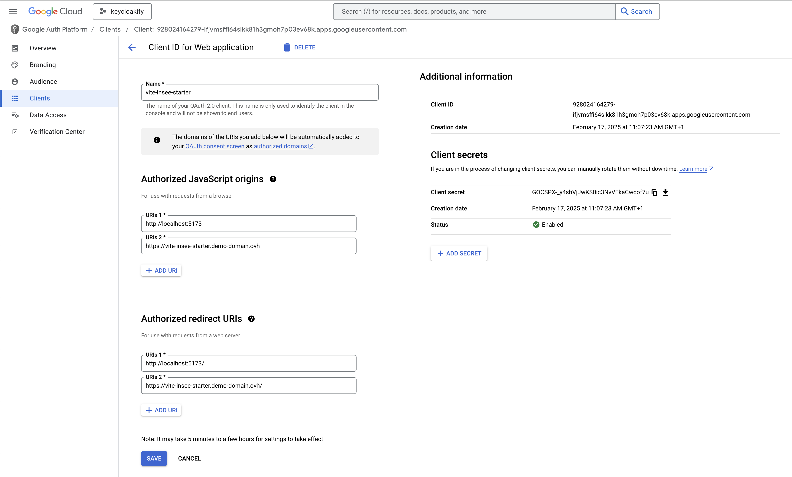

# Google OAuth

With `oidc-spa`, you would typically use an OIDC Provider like Keycloak to centralize authentication and configure Google as an identity provider within Keycloak. This allows users to select "Google" as a login option.

That being said, if you don't have a Keycloak instance, you can configure `oidc-spa` directly with Google, as demonstrated in the following video:



## Google Cloud Console Configuration

To set up authentication via Google, follow these steps in the **Google Cloud Console**:

1. Navigate to **Google Cloud Platform Console**.
2. Go to **API & Services** → **Credentials**.
3. Click **Create Credentials** → **OAuth Client ID**.
4. Choose **Application Type: Web Application**.
5. Set the **Authorized Redirect URIs**:
   * **https://my-app.com/** and **http://localhost:5173/** (Ensure the trailing slash is included).
   * If your app is hosted under a subpath (e.g., `/dashboard`), set:
     * **https://my-app.com/dashboard/**
     * **http://localhost:5173/dashboard/**
   * `5173` is Vite's default development server port—adjust as needed.
6. Set the **Authorized JavaScript Origins** to match the origins of your redirect URIs.

<figure><figcaption></figcaption></figure>


#### Client Secret

Google's OAuth implementation has a significant flaw: **PKCE-based authentication fails unless a client secret is provided**.

For public clients, storing secrets is inherently insecure. **PKCE (Proof Key for Code Exchange)** exists precisely to prevent code interception, and Google supports PKCE. **Requiring a client secret in addition to PKCE is unnecessary and misleading**.

That said, **providing the client secret in your frontend code for this specific case has no security implications**. This is purely a poor API design decision on Google's part.



## Subtituing the Access Token by the ID Token

Google OAuth do not issue JWT Access Token and there is no way to configure it so it does.

As a result, if you want to implement an API you'll have to call Google's special endpoint to validate the access token and get user infos.  \
You won't be able to implement the standard approach for validating token described in the[ Web API](../web-api.md) section.

Well there is a way to go around this, and that is to ask oidc-spa to substitute the Acess Token by the ID token. &#x20;

Be aware that this is a hack, the ID token is not meant to be sent to the API but it works.


Here’s how to configure `oidc-spa` to work with Google:



```typescript
import { createOidc } from "oidc-spa";

export const prOidc = createOidc({
    issuerUri: "https://accounts.google.com",
    clientId: "928024164279-ifjvmsffi64slkk81h3gmoh7p03ev68k.apps.googleusercontent.com",
    homeUrl: import.meta.env.BASE_URL,
    __unsafe_clientSecret: "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",
    __unsafe_useIdTokenAsAccessToken: true
});
```



```typescript
import { createReactOidc } from "oidc-spa/react";

export const { OidcProvider, useOidc, getOidc } = createReactOidc({
    issuerUri: "https://accounts.google.com",
    clientId: "928024164279-ifjvmsffi64slkk81h3gmoh7p03ev68k.apps.googleusercontent.com",
    homeUrl: import.meta.env.BASE_URL,
    __unsafe_clientSecret: "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",
    __unsafe_useIdTokenAsAccessToken: true
});
```



## Testing

```bash
git clone https://github.com/keycloakify/oidc-spa
cd oidc-spa
git checkout v5.7.0
cd ..
mv oidc-spa/examples/tanstack-router-file-based oidc-spa-tanstack-router
rm -rf oidc-spa
cd oidc-spa-tanstack-router
cp .env.local.sample .env.local
# Here, uncomment the Google section and comment the Keycloak section
# in the .env.local file.
yarn
yarn dev
```
